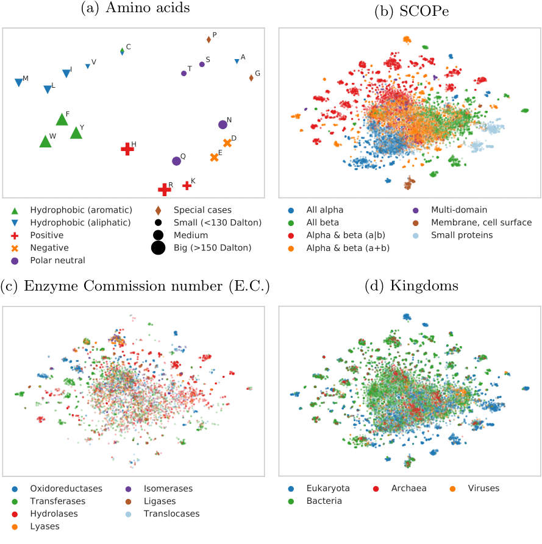

# SeqVec

Repository for the paper [Modelling the Language of Life - Deep Learning Protein Sequences](https://www.biorxiv.org/content/10.1101/614313v3).
Holds pre-trained SeqVec model for creating embeddings for amino acid sequences. Also, contains checkpoint for fine-tuning.

# Abstract
**Background**: One common task in Computational Biology is the prediction of aspects of protein function and structure from their amino acid sequence. For 26 years, most state-of-the-art approaches toward this end have been marrying machine learning and evolutionary information. The retrieval of related proteins from ever growing sequence databases is becoming so time-consuming that the analysis of entire proteomes becomes challenging. On top, evolutionary information is less powerful for small families, e.g. for proteins from the Dark Proteome.

**Results**: We introduce a novel way to represent protein sequences as continuous vectors (embeddings) by using the deep bi-directional model ELMo taken from natural language processing (NLP). The model has effectively captured the biophysical properties of protein sequences from unlabeled big data (UniRef50). After training, this knowledge is transferred to single protein sequences by predicting relevant sequence features. We refer to these new embeddings as SeqVec (Sequence-to-Vector) and demonstrate their effectiveness by training simple convolutional neural networks on existing data sets for two completely different prediction tasks. At the per-residue level, we significantly improved secondary structure (for NetSurfP-2.0 data set: Q3=79%±1, Q8=68%±1) and disorder predictions (MCC=0.59±0.03) over methods not using evolutionary information. At the per-protein level, we predicted subcellular localization in ten classes (for DeepLoc data set: Q10=68%±1) and distinguished membrane- bound from water-soluble proteins (Q2= 87%±1). All results built upon the embeddings gained from the new tool SeqVec neither explicitly nor implicitly using evolutionary information. Nevertheless, it improved over some methods using such information. Where the lightning-fast HHblits needed on average about two minutes to generate the evolutionary information for a target protein, SeqVec created the vector representation on average in 0.03 seconds.

**Conclusion**: We have shown that transfer learning can be used to capture biochemical or biophysical properties of protein sequences from large unlabeled sequence databases. The effectiveness of the proposed approach was showcased for different prediction tasks using only single protein sequences. SeqVec embeddings enable predictions that outperform even some methods using evolutionary information. Thus, they prove to condense the underlying principles of protein sequences. This might be the first step towards competitive predictions based only on single protein sequences.

# t-SNE projections of SeqVec

*2D t-SNE projections of unsupervised SeqVec embeddings highlight different realities of proteins and their constituent parts, amino acids.* Panels (b) to (d) are based on the same data set (Structural Classification of Proteins – extended (SCOPe) 2.07, redundancy reduced at 40%). For these plots, only subsets of SCOPe containing proteins with the annotation of interest (enzymatic activity (c) and kingdom (d)) may be displayed. **Panel (a)**: the embedding space confirms: the 20 standard amino acids are clustered according to their biochemical and biophysical properties, i.e. hydrophobicity, charge or size. The unique role of Cysteine (C, mostly hydrophobic and polar) is conserved. **Panel (b)**: SeqVec embeddings capture structural information as annotated in the main classes in SCOPe without ever having been explicitly trained on structural features. **Panel (c)**: many small, local clusters share function as given by the main classes in the Enzyme Commission Number (E.C.). **Panel (d)**: similarly, small, local clusters represent different kingdoms of life.

# Model availability
The ELMo model trained on UniRef50 (=SeqVec) is available at:
[SeqVec-model](https://rostlab.org/~deepppi/seqvec.zip)

The checkpoint for the pre-trained model is available at:
[SeqVec-checkpoint](https://rostlab.org/~deepppi/seqvec_checkpoint.tar.gz)

# Installation

```
pip install seqvec
```

We are working on a python package with more embedders and a commong interface to them; see [bio_embeddings](https://github.com/sacdallago/bio_embeddings)

# Example

In the [bio_embeddings](https://github.com/sacdallago/bio_embeddings) github repo, you can find examples in the `notebooks` folder.

For a general example on how to extract embeddings using ELMo, please check the 
official allennlp ELMo website: [ELMo-Tutorial](https://github.com/allenai/allennlp/blob/master/tutorials/how_to/elmo.md)

You can compute embeddings for a fasta file with the `seqvec` command. Add `--protein True` to get an embedding per protein instead of per residue.

```
seqvec -i sequences.fasta -o embeddings.npz
```

Load the embeddings with numpy:

```python
import numpy as np
data = np.load("embeddings.npz")  # type: Dict[str, np.ndarray]
```

If you specify `.npy` as output format (e.g. with `-o embeddings.npy`), the script will save the embeddings as an numpy array and the corresponding identifiers (as extracted from the header line in the fasta file) in a json file besides it. The sorting in the json file corresponds to the indexing in the npy file. The npy file can be loaded via:

```python
import json
import numpy as np

data = np.load("embeddings.npy") # shape=(n_proteins,)
with open("embeddings.json") as fp:
    labels = json.load(fp)
```

**How to integrate the embedder into an existing workflow:**


Load pre-trained model:

```python
from allennlp.commands.elmo import ElmoEmbedder
from pathlib import Path

model_dir = Path('path/to/pretrained/SeqVec_directory')
weights = model_dir / 'weights.hdf5'
options = model_dir / 'options.json'
embedder = ElmoEmbedder(options,weights, cuda_device=0) # cuda_device=-1 for CPU
```

Get embedding for amino acid sequence:

```python
seq = 'SEQWENCE' # your amino acid sequence
embedding = embedder.embed_sentence(list(seq)) # List-of-Lists with shape [3,L,1024]
```

Batch embed sequences:

```python
seq1 = 'SEQWENCE' # your amino acid sequence
seq2 = 'PROTEIN'
seqs = [list(seq1), list(seq2)]
seqs.sort(key=len) # sorting is crucial for speed
embedding = embedder.embed_sentences(seqs) # returns: List-of-Lists with shape [3,L,1024]
```

Get 1024-dimensional embedding for per-residue predictions:

```python
import torch
residue_embd = torch.tensor(embedding).sum(dim=0) # Tensor with shape [L,1024]
```

Get 1024-dimensional embedding for per-protein predictions:
```python
protein_embd = torch.tensor(embedding).sum(dim=0).mean(dim=0) # Vector with shape [1024]
```

# Web-service for Predictions based on SeqVec
[SeqVec predictions - Chris' Protein properties](https://embed.protein.properties/)

# Bibtex-Reference
```
@article{heinzinger2019modeling,
  title={Modeling the Language of Life-Deep Learning Protein Sequences},
  author={Heinzinger, Michael and Elnaggar, Ahmed and Wang, Yu and Dallago, Christian and Nachaev, Dmitrii and Matthes, Florian and Rost, Burkhard},
  journal={bioRxiv},
  pages={614313},
  year={2019},
  publisher={Cold Spring Harbor Laboratory}
}
```
